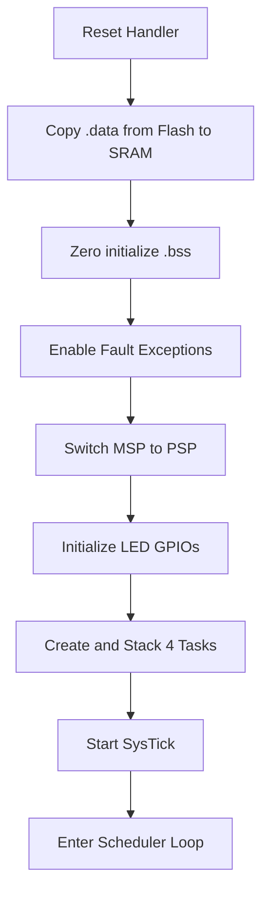

# Round-Robin RTOS in Pure Assembly (STM32F407VG)

> **Author:** Basavaraj | **Platform:** STM32F407 Discovery | **Language:** ARM Cortex-M Assembly (no C, no RTOS)

---

## Project Overview

This project demonstrates a **bare-metal Round-Robin scheduler** implemented *entirely in assembly* on the STM32F407VG (Cortex-M4). The scheduler handles multiple tasks blinking LEDs without relying on any RTOS or C runtime.

It covers:
- Manual boot/startup sequence
- Memory section handling (.text, .data, .bss)
- Stack pointer switching (MSP to PSP)
- Exception and interrupt setup
- Context saving/restoring with PendSV and SysTick
- A fully working multitasking scheduler with wait and ready states

---

## Memory Layout (Linker Script)

```ld
MEMORY {
  FLASH (Rx)  : ORIGIN = 0x08000000, LENGTH = 1M
  SRAM  (RWX) : ORIGIN = 0x20000000, LENGTH = 128K
}

SECTIONS {
  .text : {
    *(.vector)
    *(.text)
    *(.rodata)
    . = ALIGN(4);
    _etext = .;
  } > FLASH

  .data : {
    _sdata = .;
    *(.data)
    . = ALIGN(4);
    _edata = .;
  } > SRAM AT > FLASH

  .bss : {
    _sbss = .;
    *(.bss)
    . = ALIGN(4);
    _ebss = .;
  } > SRAM
}
```

###  Highlights
- **.vector**: Vector table for exceptions/interrupts
- **.text**: Startup code, handlers, scheduler logic
- **.rodata**: Constants
- **.data**: Runtime init variables, copied from flash
- **.bss**: Zero-initialized variables

---

## Boot Flow Diagram



---

##  Assembly Highlights

### Reset Handler
- Loaded into PC from vector table
- Calls `main`

###  Startup (main.s)
```asm
    LDR R1, =_sdata
    LDR R2, =_edata
    LDR R3, =_etext
copy_data:
    LDRB R0, [R3], #1
    STRB R0, [R1], #1
    CMP R1, R2
    BNE copy_data
```

###  Zeroing .bss
```asm
    LDR R1, =_sbss
    LDR R2, =_ebss
clear_bss:
    MOV R0, #0
    STR R0, [R1], #4
    CMP R1, R2
    BNE clear_bss
```

###  Enabling Fault Handlers
```asm
    LDR R0, =0xE000ED24
    LDR R1, =0x70000
    STR R1, [R0]   ; Enable Usage, Bus, Mem Faults
```

###  Stack Switching MSP → PSP
```asm
    LDR R0, =_initial_psp
    MSR PSP, R0
    MOVS R0, #0x02
    MSR CONTROL, R0
```

---

## Task Scheduler (Round-Robin)

###  SysTick
- Fires every few milliseconds
- Triggers PendSV

###  PendSV Handler
- Saves R4-R11 of current task to its stack
- Updates task pointer to next task
- Restores R4-R11 of next task from its stack

```asm
    MRS R0, PSP
    STMDB R0!, {R4-R11}
    ; switch task pointer
    LDMIA R0!, {R4-R11}
    MSR PSP, R0
```

---

##  LED Task Logic
Each task:
- Toggles a GPIO pin (LED)
- Delays in a loop (creates wait state)
- Then re-enters ready state for scheduling

State model:
```mermaid
stateDiagram-v2
    [*] --> Ready
    Ready --> Running
    Running --> Wait : delay
    Wait --> Ready : tick

